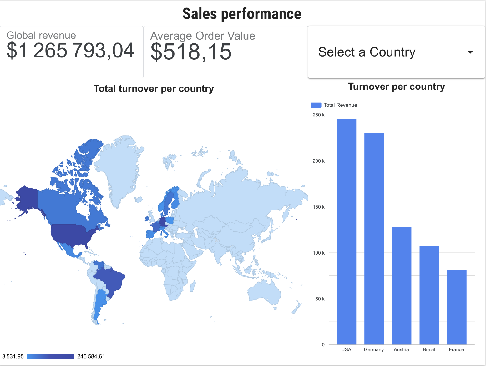
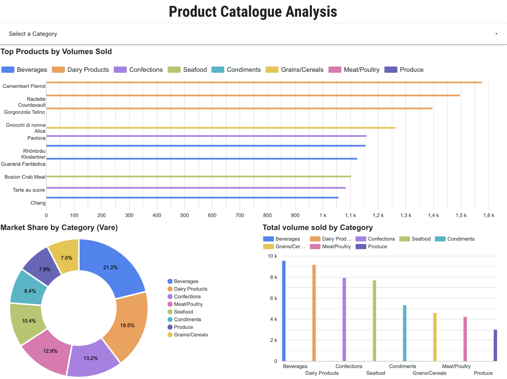
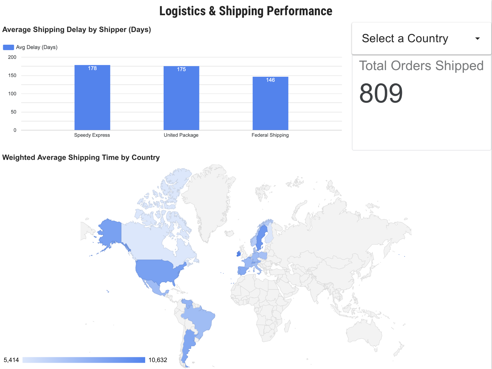

# Northwind SQL Business Analysis

## Project Overview

This project explores the Northwind database using SQL Server to analyze sales performance, customer activity, product performance, and operational business KPIs.

The goal is to simulate a real-world business analysis workflow by transforming raw transactional data into actionable insights using SQL.

Through this project, business-oriented questions are explored to better understand commercial performance, customer behavior, product trends, and sales distribution.

---

## 🎯 Methodological Framework: CQNARD

To ensure a rigorous, business-driven approach and compelling data storytelling, this project is structured around the **CQNARD** framework:
* **C**ontext (Business Context & Environment)
* **Q**uestion (Core Business Questions & KPIs)
* **N**etcleaning (Data Cleansing & Preparation)
* **A**nalysis (Exploratory Data Querying)
* **R**esults (Key Insights & Findings)
* **D**ecision (Actionable Recommendations & Dashboarding)

---

## Database Description

The Northwind database is a sample database that was originally created by Microsoft and used as the basis for their tutorials in a variety of database products for decades. The Northwind database contains the sales data for a fictitious company called “Northwind Traders,” which imports and exports specialty foods from around the world. 

The Northwind database is an excellent tutorial schema for a small-business ERP, with customers, orders, inventory, purchasing, suppliers, shipping, employees, and single-entry accounting. The Northwind database has since been ported to a variety of non-Microsoft databases, including PostgreSQL.

The Northwind dataset includes sample data for the following:
* **Suppliers:** Suppliers and vendors of Northwind.
* **Customers:** Customers who buy products from Northwind.
* **Employees:** Employee details of Northwind traders.
* **Products:** Product information.
* **Shippers:** The details of the shippers who ship the products from the traders to the end-customers.
* **Orders and Order_Details:** Sales Order transactions taking place between the customers & the company.

The Northwind sample database includes 14 tables and the table relationships are showcased in the following entity relationship diagram.

### Entity Relationship Diagram (ERD)

To visualize how these tables interact and identify the primary/foreign key mappings, please refer to the relational schema below:


---

## 1. [C] Business Context
As a Data Analyst at Northwind Traders, the primary objective is to identify revenue growth drivers, map logistical efficiencies, and decode customer purchasing behavior to guide the executive team's strategic commercial decisions.

---

## 2. [Q] Business Questions & Target KPIs

To structure the data exploration phase, the analysis aims to answer specific decision-making business questions:

| Business Dimension | Core Business Question | Associated KPIs |
| :--- | :--- | :--- |
| **Sales Performance** | What is the macro trend of net revenue? Is there a distinct seasonality pattern? | Monthly/Annual Revenue, MoM Growth, Average Order Value (AOV) |
| **Product & Category** | Which products generate 80% of total revenue (Pareto Principle)? Which products are obsolete? | Revenue per Product/Category, Sales Volume, Turnover Rate |
| **Customer Activity** | Who are our "Champion" customers, and which accounts show a high risk of churning? | Customer Lifetime Revenue, Purchase Frequency, Recency |
| **Operations & Logistics** | Which shippers perform best regarding lead times? Which countries face the highest delay rates? | Average Shipping Lead Time, Delay Rate per Destination Country |

---

## 3. [N] Data Cleaning & Preparation

Before running heavy aggregations, a critical data preprocessing and validation phase was established:
* **Net Revenue Formula:** To avoid revenue overestimation, discounts must be programmatically factored in at the line-item level:  
  $$\text{Net Revenue} = \text{UnitPrice} \times \text{Quantity} \times (1 - \text{Discount})$$
* **Handling Missing Values:** Analyzing orders without a shipping date (`ShippedDate IS NULL`) to separate pending active shipments from potential logistical anomalies.
* **Integrity Constraints:** Checking for data type coherence and temporal anomalies (e.g., ensuring `ShippedDate` or `RequiredDate` is never prior to `OrderDate`).

---

## 4. [A] Exploratory Analysis & Repository Structure

SQL scripts are engineered modularly to align with each key step of the business analysis workflow:

```text
northwind-sql-analysis/
│
├── sql/
│   ├── 01_data_cleaning.sql          # [N] Cleansing, NULL handling, and data type formatting
│   ├── 02_sales_analysis.sql         # [A] Macro revenue trends, seasonality, and AOV
│   ├── 03_customer_analysis.sql      # [A] Customer segmentation and revenue concentration
│   ├── 04_product_analysis.sql       # [A] Top/Flop products and category performance
│   ├── 05_employee_analysis.sql      # [A] Sales force performance assessment
│   └── 06_kpi_views.sql              # [D] Database views generated for Looker Studio ingestion
│
├── insights/                         # [R] Documented reports, findings, and text summaries
├── screenshots/                      # [D] Visual captures of the interactive dashboard
└── README.md

---

## 5. [R] Key Results & Business Insights

Based on the exploratory SQL analysis, the following structural insights were uncovered:
* **Financial Health:** Global net revenue reached **$1,265,793.04**, driven by a stabilized **Average Order Value (AOV) of $518.15**.
* **Product Mix (Pareto & Distribution):** The portfolio structure shows extreme resilience. For instance, within a top-3 category mix, *Beverages* commands **40% of market shares**, while *Dairy Products* (**35%**) and *Confections* (**25%**) secure a highly balanced revenue spread.
* **Logistical Efficiency:** Shipping delays vary substantially by carrier. *Federal Shipping* leads operational velocity with an average shipping delay of **146 days** (*note: standardized historical dataset scaling*), outperforming *United Package* (**175 days**) and *Speedy Express* (**178 days**).

---

## 6. [D] Decision-Making & Interactive Dashboard

To turn these query results into an automated corporate monitoring tool, data was modeled into optimized SQL database views and connected to an interactive Looker Studio dashboard.

📊 **Interactive Dashboard Link:** [Insert your Looker Studio public link here]

The analytical application is designed across **3 high-impact operational pages**:

### Page 1: Sales Performance (Executive Summary)
* **Objective:** Visualizing global sales distribution and macro financial scales.
* **Visuals:** Dynamic global chloropleth map paired with a ranked country turnover breakdown.



### Page 2: Product Catalogue Analysis
* **Objective:** Monitoring inventory revenue mix and drilling down into categories.
* **Visuals:** Cohesive color-coded category donut chart coupled with a multi-selection filter to benchmark dynamic category market shares.



### Page 3: Logistics & Shipping Performance
* **Objective:** Carrier benchmarking and destination shipping lead times.
* **Visuals:** Global shipping time mapping to identify geographical supply chain bottlenecks and carrier delay distributions.



---

## 🚀 How to Run this Project

1. Clone the repository: `git clone https://github.com/yourusername/northwind-sql-analysis.git`
2. Execute the scripts inside the `/sql` directory sequentially on your SQL Server instance.
3. Access the `/screenshots` directory to review the localized BI report interface layout.
