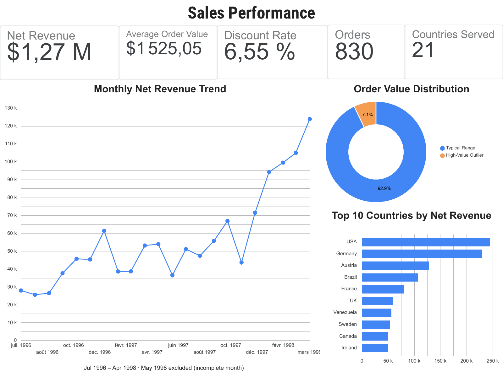
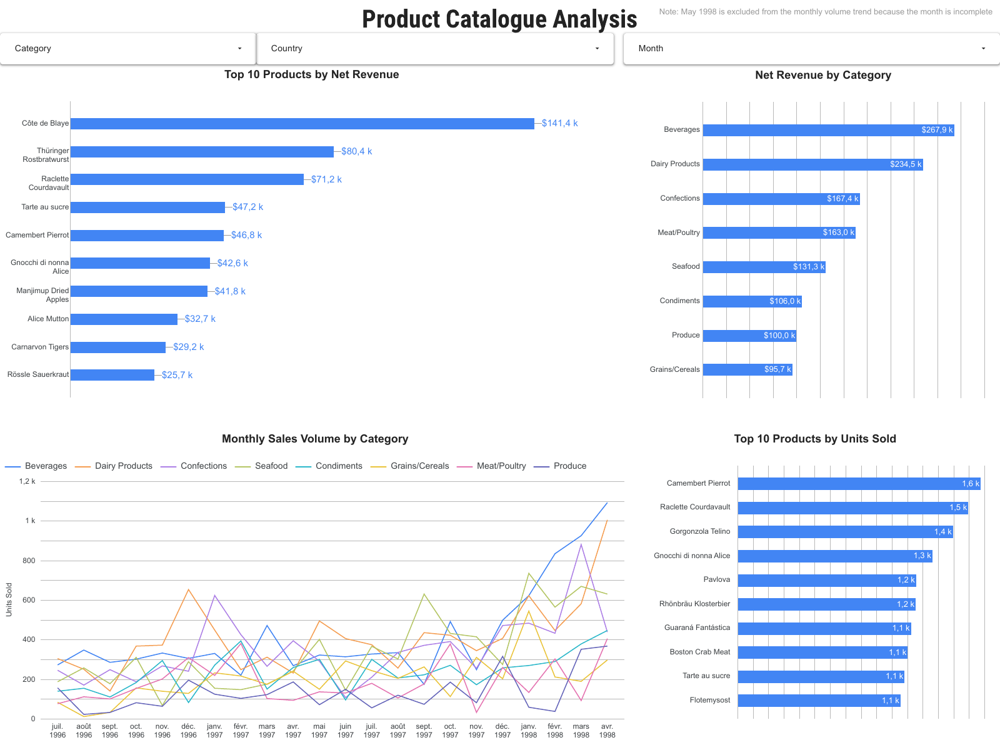
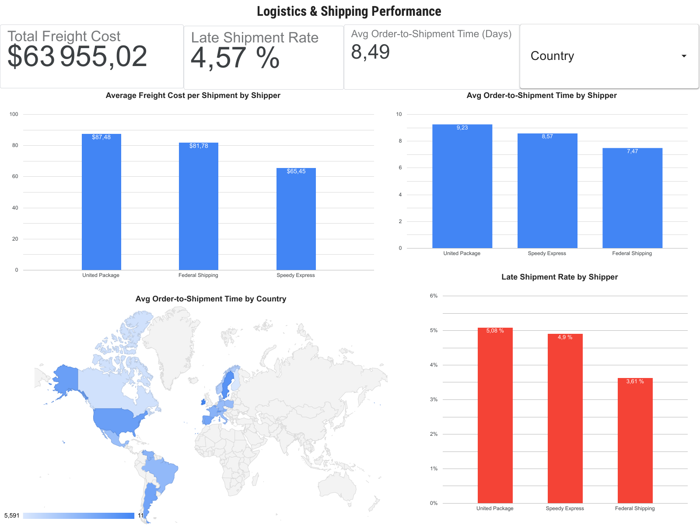
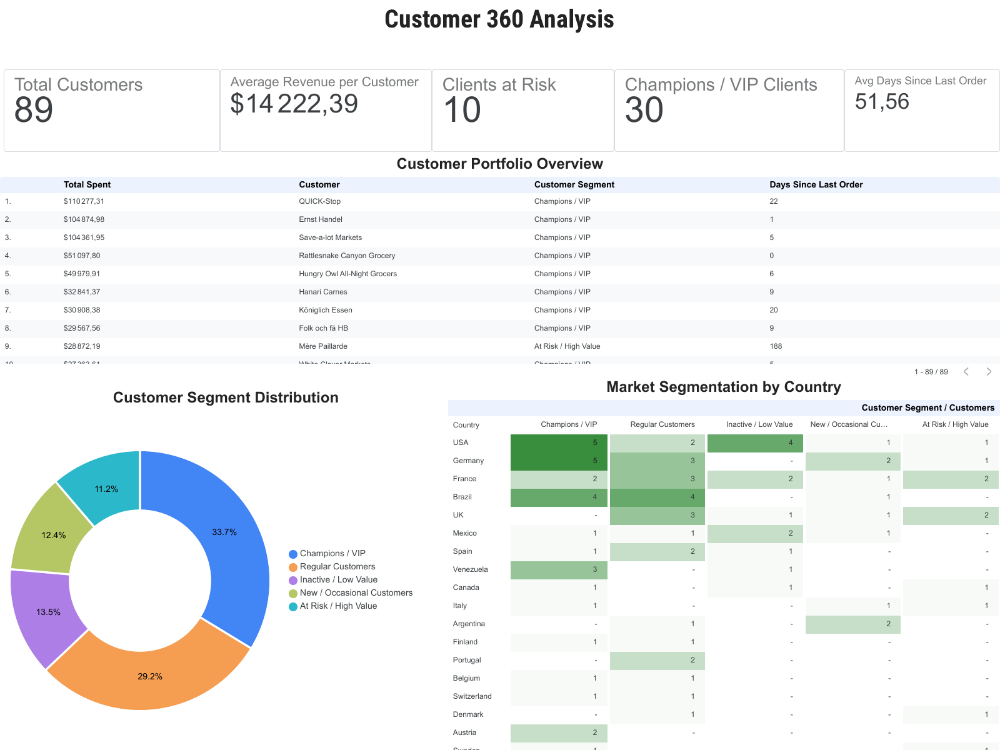
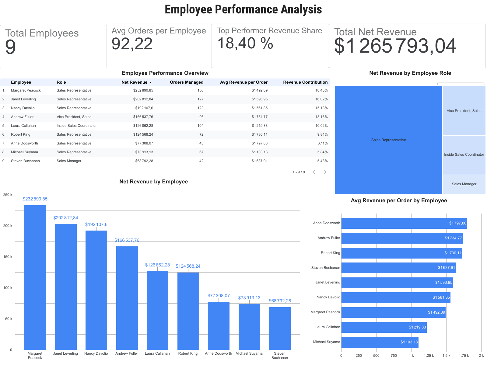

# Northwind Business Analysis — SQL Server & Looker Studio

A portfolio case study turning Northwind's sample transactional data into business analysis and interactive reporting across sales, products, customers, shipping, and employee activity.

**Tools:** SQL Server · T-SQL · Looker Studio  
**Deliverables:** data-quality audit, business analysis scripts, six reporting views, and five dashboard pages.

**[Explore the interactive Looker Studio report](https://datastudio.google.com/s/gjPixVIulsE)**

## Project objective

Acting as a data analyst for the fictitious Northwind Traders company, this project investigates revenue drivers, customer purchasing patterns, product demand, shipment timing, and the distribution of sales activity across employees. It connects business questions to explicit KPI definitions, SQL transformations, and visual analysis.

The workflow runs from SQL analysis to dashboard reporting: **execute the SQL scripts → export the result sets → import the data into Looker Studio**. This is an analysis of a historical sample dataset, with proposed actions rather than measured business impact.

## Results at a glance

| Indicator | Revised dashboard |
| --- | ---: |
| Net revenue | Approximately $1.27 million |
| Orders | 830 |
| Countries served | 21 |
| Average order value | $1,525.05 |
| Discount rate | 6.55% |
| Customers with purchase history | 89 |
| Employees represented | 9 |

The sales trend covers July 1996 through April 1998 and explicitly excludes the incomplete May 1998 month. This exclusion applies to the trend chart; it should not be assumed to apply to every headline KPI.

### Five business findings

1. **Revenue is concentrated geographically.** The USA and Germany lead the country revenue ranking. High-value outliers account for **7.1% of orders** under the IQR classification. These views support a review of market concentration and large-order exposure; the remaining 92.9% in the typical range does not establish low variance or forecast accuracy.

2. **Product priorities differ by revenue and volume.** Côte de Blaye leads product net revenue at approximately **$141.4k**, while Camembert Pierrot leads units sold at approximately **1.6k units**. Beverages and Dairy Products generate approximately **$267.9k** and **$234.5k**, respectively—roughly **40% of revenue**, calculated from the rounded displayed amounts. This supports separate reviews of high-revenue products and high-volume replenishment needs, subject to stock and lead-time evidence.

3. **High-value customer inactivity provides a focused review list.** The revised segmentation shows **30 Champions / VIP customers (33.7%)** and **10 At Risk / High Value customers (11.2%)**. Mère Paillarde illustrates the latter group, with **$28,872.19** in historical net purchases and **188 days since its last order** at the dataset reference date. These accounts are candidates for contact-history review; inactivity is not confirmed churn.

4. **Shipment timing warrants operational investigation.** The dashboard reports **8.49 days** from order to shipment on average and a **4.57%** late-shipment rate. Orders assigned to Federal Shipping show **7.47 days** and **3.61%**, compared with **9.23 days** and **5.08%** for United Package. These differences support investigation of order mix and fulfillment processes, without establishing carrier responsibility or customer delivery performance.

5. **The revenue leader and the AOV leader are different employees.** Margaret Peacock manages **156 orders**, generating approximately **$232.9k** and **18.40%** of company net revenue. Anne Dodsworth has the highest displayed revenue per order at **$1,797.86**, across **43 orders**. These are complementary measures of sales activity; territory, account allocation, tenure, and targets are needed to assess individual performance fairly.

*Metrics and screenshots: the five-page export `Northwind_—_Business_Performance_Dashboard.pdf`, based on imported SQL results. Monetary notation is normalized to English in this README.*

## Dashboard preview

The report contains five complementary business views. Expand each section to see the corresponding capture.

### Sales Performance

Revenue trend, country ranking, headline KPIs, and order-value classification.



<details>
<summary>Product Performance</summary>

Product revenue and volume rankings, category revenue, and monthly category volumes. May 1998 is excluded from the monthly volume trend.



</details>

<details>
<summary>Logistics & Shipping</summary>

Order-to-shipment lead times, shipment timing, and recorded freight amounts by carrier and destination.



</details>

<details>
<summary>Customer Analysis</summary>

Customer purchase history, RFM segmentation, and segment distribution by customer country.



</details>

<details>
<summary>Employee Performance</summary>

Employee revenue, order counts, revenue contribution, average order value, and revenue by role.



</details>

## SQL analysis and repository structure

The analysis follows the CQNARD sequence: Context, Questions, data quality and preparation, Analysis, Results, and Decisions.

| File | Analytical purpose |
| --- | --- |
| `SQL/01_data_cleaning.sql` | Non-destructive quality audit: financial fields, missing references, dates, pending orders, and inventory snapshot |
| `SQL/02_sales_analysis.sql` | Monthly revenue, growth, cumulative revenue, and first-observed customer orders |
| `SQL/03_customer_analysis.sql` | Customer value, RFM segmentation, inactivity monitoring, and regional basket comparisons |
| `SQL/04_product_analysis.sql` | Product/category rankings, revenue versus volume profiles, discount exposure, and inventory snapshot |
| `SQL/05_logistics_analysis.sql` | Shipment timing, lead times, freight amounts, and carrier/destination comparisons |
| `SQL/06_employee_analysis.sql` | Employee metrics, revenue contribution, and customer-geography footprint |
| `SQL/07_kpi_views.sql` | Six reporting views using conditional creation followed by `ALTER VIEW`, plus reconciliation queries |
| `screenshots/` | Five dashboard captures referenced by this README |
| [Northwind_ER_A4.pdf](Northwind_ER_A4.pdf) | Database relationship diagram |
| `README.md` | Project objectives, results, metric definitions, and reproduction notes |

The `SQL/` folder contains seven scripts, numbered `01` through `07`. `SQL/07_kpi_views.sql` includes view deployment and reconciliation queries. SQL analysis also includes outputs beyond those displayed in the dashboard.

## Metric definitions and reporting model

### Revenue and order value

Calculations use transaction-time fields from `[Order Details]`, rather than current prices from `Products`:

```text
Gross revenue   = SUM(Quantity × UnitPrice)
Discount amount = SUM(Quantity × UnitPrice × Discount)
Net revenue     = SUM(Quantity × UnitPrice × (1 − Discount))
Discount rate   = Discount amount / Gross revenue
AOV             = Net revenue / Distinct orders
```

Financial inputs are cast to `DECIMAL`, with rounding generally applied at presentation time. Freight is separate from product net revenue. These measures do not establish profit or margin.

Order lines are aggregated to orders before calculating customer and employee metrics. Overall AOV uses total revenue divided by total orders, rather than an average of country or employee AOVs. Counts of orders containing a product or category are not additive across products or categories.

### Customer segmentation and shipment timing

**RFM:** recency is measured against the latest order date in the dataset, frequency counts distinct orders with detail records, and monetary value sums net purchases. `PERCENT_RANK()` produces relative scores from 1 to 4 while preserving ties. Champions have R, F, and M scores of at least 3; At Risk / High Value customers have R ≤ 2 and F and M ≥ 3. The separate 90-day inactivity query is a different monitoring rule. The 89 customers represented have purchase history; the figure is not a count of every customer record.

**Shipping:** lead time is the day difference between `OrderDate` and `ShippedDate`. The view retains valid shipped orders with shipper records. A late shipment satisfies `ShippedDate > RequiredDate`; missing required dates are excluded from the rate denominator. Pending orders are audited separately. `ShippedDate` is not a delivery date. The dashboard's freight figures represent recorded order amounts, whose accounting treatment is not established by the dataset.

### Six reporting views

| View | Row grain |
| --- | --- |
| `v_bi_regional_turnover_update` | Shipping country |
| `v_bi_order_value_outliers` | Order with order-detail records |
| `v_bi_product_performance_by_region` | Product × shipping country × order month |
| `v_bi_shipping_performance` | Valid shipped order with a shipper record |
| `v_bi_customer_360` | Customer with purchase history |
| `v_bi_employee_performance` | Employee with order-detail-backed sales activity |

Sales and shipping use `ShipCountry`; customer analysis uses `Customers.Country`. IQR thresholds and employee contribution denominators are computed over their full SQL source populations. Product ranks apply within each country-month, not globally. Dashboard filters do not automatically recompute these definitions.

## Reproduce the analysis

1. Load Northwind into a dedicated SQL Server database. The scripts require `Orders`, `[Order Details]`, `Customers`, `Products`, `Categories`, `Shippers`, and `Employees` in the `dbo` schema. The installation dataset is not included in the SQL archive.
2. Replace each leading `USE master;` with the database containing those tables, for example `USE [Northwind];`. Use a SQL client configured for T-SQL and `GO` batches, with read access and permission to create or alter views.
3. Run `SQL/01_data_cleaning.sql` and review its findings. Despite its legacy name, it audits data without updating or deleting records. Then execute analysis scripts `02` through `06` in `SQL/`.
4. Execute `SQL/07_kpi_views.sql`, including its final reconciliation queries to compare revenue and order totals across the reporting views. Shipping intentionally covers a narrower population than overall sales.
5. Export the required result sets and import them into Looker Studio. Set field types and aggregations, build the five reporting pages, and align filters with the intended KPI scope. Refreshing the dashboard data requires repeating the export/import process.

For complete environment reproduction, document the exact Northwind installation source, SQL Server version, and exported file-to-Looker-source mapping alongside the repository. The environment must support the T-SQL functions used by the scripts.

## Analytical limits and reconciliation

- **Financial precision:** overall revenue is summarized as approximately $1.27 million. The dashboard total is $1,265,793.04, its displayed employee amounts sum to $1,265,793.05, and the product SQL's fixed reconciliation target is $1,265,793.22. An exact shared baseline requires comparing unrounded outputs and exported precision; the cause of these differences is not established here.
- **Time coverage:** monthly SQL queries infer the final incomplete month from the latest order date. BI views retain all available months, so trend exclusions must be applied in reporting. First-month coverage and missing months also need consideration when interpreting growth; the short history does not establish recurring seasonality.
- **Causality and scope:** discount comparisons do not estimate promotional effects or price elasticity. Inventory fields are a snapshot, not historical stock records. Shipment timing differences and employee sales rankings need operational context before business action.

## Skills demonstrated

T-SQL joins and CTEs; window functions (`LAG`, `RANK`, `PERCENT_RANK`, `PERCENTILE_CONT`, cumulative sums); quality auditing; transaction-level financial calculations; RFM segmentation; IQR classification; reporting-view design; aggregation-grain management; dashboard design; and evidence-based business interpretation.
