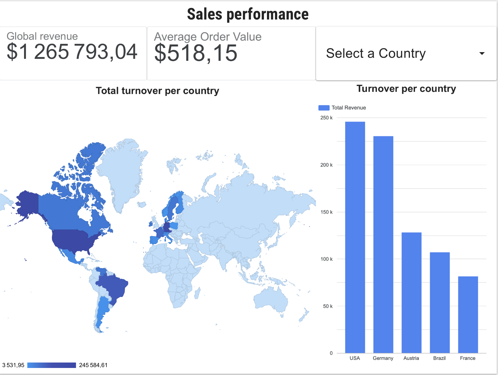
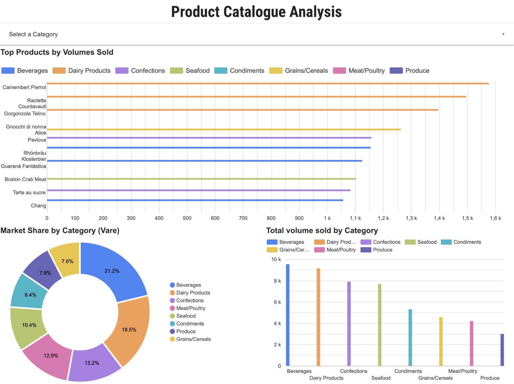
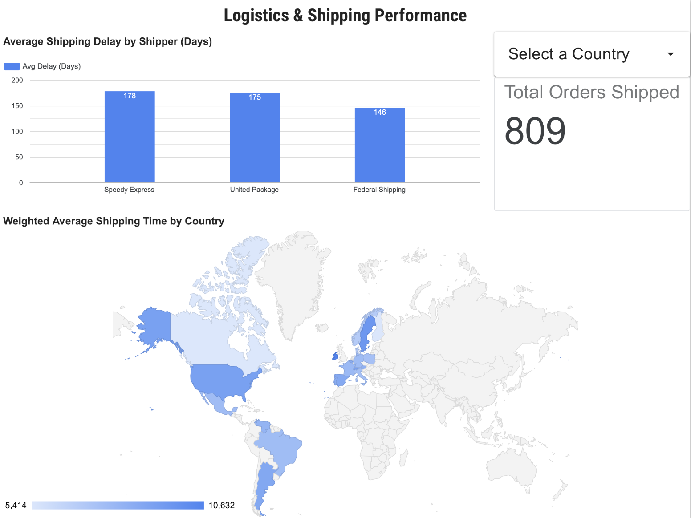
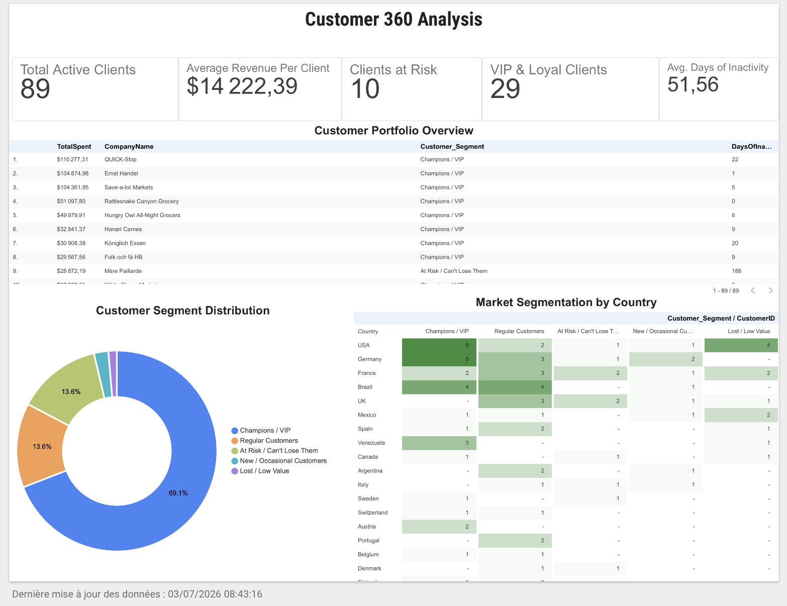
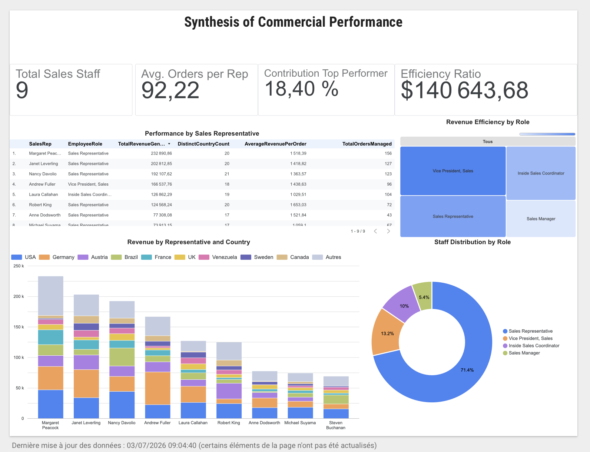

# Northwind SQL Business Analysis

## Project Overview

This project explores the Northwind database using SQL Server to analyze sales performance, customer activity, product performance, and operational business KPIs.

The goal is to simulate a real-world business analysis workflow by transforming raw transactional data into actionable insights using SQL.

Through this project, business-oriented questions are explored to better understand commercial performance, customer behavior, product trends, and sales distribution.

---

## 🎯 Methodological Framework: CQNARD

To ensure a rigorous, business-driven approach and compelling data storytelling, this project is structured around the **CQNARD** framework:
* **C**ontext (Business Context & Environment)
* **Q**uestion (Core Business Questions & KPIs)
* **N**etcleaning (Data Cleansing & Preparation)
* **A**nalysis (Exploratory Data Querying)
* **R**esults (Key Insights & Findings)
* **D**ecision (Actionable Recommendations & Dashboarding)

---

## Database Description

The Northwind database is a sample database that was originally created by Microsoft and used as the basis for their tutorials in a variety of database products for decades. The Northwind database contains the sales data for a fictitious company called “Northwind Traders,” which imports and exports specialty foods from around the world. 

The Northwind database is an excellent tutorial schema for a small-business ERP, with customers, orders, inventory, purchasing, suppliers, shipping, employees, and single-entry accounting. The Northwind database has since been ported to a variety of non-Microsoft databases, including PostgreSQL.

The Northwind dataset includes sample data for the following:
* **Suppliers:** Suppliers and vendors of Northwind.
* **Customers:** Customers who buy products from Northwind.
* **Employees:** Employee details of Northwind traders.
* **Products:** Product information.
* **Shippers:** The details of the shippers who ship the products from the traders to the end-customers.
* **Orders and Order_Details:** Sales Order transactions taking place between the customers & the company.

The Northwind sample database includes 14 tables and the table relationships are showcased in the following entity relationship diagram.

### Entity Relationship Diagram (ERD)

To visualize how these tables interact and identify the primary/foreign key mappings, please refer to the relational schema below:

---

## 1. [C] Business Context
As a Data Analyst at Northwind Traders, the primary objective is to identify revenue growth drivers, map logistical efficiencies, and decode customer purchasing behavior to guide the executive team's strategic commercial decisions.

---

## 2. [Q] Business Questions & Target KPIs

To structure the data exploration and the final BI architecture, the analysis aims to answer specific decision-making business questions across 5 core dimensions:

| Business Dimension | Core Business Question | Associated KPIs |
| :--- | :--- | :--- |
| **Sales & Regional Strategy** | What is the macroeconomic trajectory, and which regions or order profiles drive the most value? | MoM Growth, Regional Average Order Value (AOV), Order Size Classification (IQR) |
| **Product & Catalog** | Which flagship products dominate the market, and do promotional discounts effectively drive volume? | Revenue Rank/Dense_Rank, Total Volume Sold, Discount Elasticity |
| **Customer Activity (CRM)** | Who are our VIP "Champions", and which valuable accounts are currently at risk of churning? | RFM Segments (Recency, Frequency, Monetary), 90-Day Churn Alert, Lifetime Revenue |
| **Operations & Logistics** | Are our shipping partners reliable, and what are the hidden supply chain costs per region? | Average Shipping Delay (Days), Late Shipment Rate (%), Average Freight Costs |
| **Sales Force Performance** | Who are our top-performing reps, and what is their efficiency and contribution to the total revenue? | Net Revenue Contribution, Rep's Average Order Value, Top Performer Share (%) |

---

## 3. [N] Data Cleaning & Preparation

Before running heavy aggregations, a critical data preprocessing and validation phase was established to ensure a "Single Source of Truth":

* **Financial Precision & Net Revenue:** To avoid revenue overestimation and floating-point errors, discounts were programmatically factored in at the line-item level with strict decimal casting:   
  **Net Revenue = Quantity × UnitPrice × (1 - Discount)**
* **Handling Missing Values:** Analyzing orders without a shipping date (`ShippedDate IS NULL`) to transform missing data into an actionable logistical KPI ("Unshipped/Backlog" status).
* **Temporal Integrity Constraints:** Checking for temporal anomalies (e.g., isolating rows where `ShippedDate` is prior to `OrderDate`) to prevent skewing the average lead time metrics.
* **Supply Chain Health:** Implementing dynamic filters to exclude discontinued items and track the inventory stock position against the critical reorder level.

---

## 4. [A] Exploratory Analysis & Repository Structure

SQL scripts are engineered modularly to align with each key step of the business analysis workflow:

* `01_data_cleaning.sql` — [N] Cleansing, NULL handling, and data type formatting
* `02_sales_analysis.sql` — [A] Macro revenue trends, seasonality, and AOV
* `03_customer_analysis.sql` — [A] Customer segmentation and revenue concentration
* `04_product_analysis.sql` — [A] Top/Flop products and category performance
* `05_logistics_analysis.sql` — [A] Shipping delays, carrier performance, and freight costs
* `06_employee_analysis.sql` — [A] Sales force performance assessment
* `07_kpi_views.sql` — [D] Database views generated for Looker Studio ingestion
* `screenshots/` — [D] Visual captures of the interactive dashboard (pages 1 to 5)
* `northwind-er-diagram.jpg` — Database entity relationship diagram
* `README.md` — Project documentation

---
## 5. [R] Key Results & Business Insights

Based on the exploratory SQL analysis and the Looker Studio data modeling, the following strategic insights were uncovered:

### 🌍 Macro Sales & Market Concentration
* **Global Footprint:** Northwind operates across **21 countries**, generating **$1,265,793.05** in net revenue across 830 distinct orders.
* **Geographic Dependency:** The revenue distribution is highly concentrated. The **USA** (approx. $245k) and **Germany** (approx. $235k) are the undisputed market leaders, heavily outperforming the next-tier markets like Austria and Brazil.
* **Financial Predictability:** Order behavior is remarkably standardized, with **92.9%** of transactions classified as "Medium Orders". This low variance solidifies the Average Order Value (AOV) of **$1,369.44** as a highly reliable baseline for revenue forecasting.
* **Margin Impact:** Total promotional discounts amounted to **$88,665.57**, representing a significant lever that needs continuous monitoring to protect gross margins.

### 📦 Product & Category Mix
* **Portfolio Pillars:** The catalog is highly dependent on two core categories: **Beverages (21.2%)** and **Dairy Products (18.5%)**, which together drive nearly 40% of the total company revenue.
* **Premium vs. Volume Strategy:** The data reveals a strong dichotomy between revenue drivers and volume drivers. The beverage **"Côte de Blaye"** is a massive revenue outlier (Premium high-ticket item), generating nearly double the revenue of the second-best item. However, the physical volume (units moved) is overwhelmingly dominated by Dairy products (Camembert, Raclette, Gorgonzola).
* **Growth & Seasonality:** The time-series analysis indicates a significant sales acceleration in **Q1 1998**, heavily propelled by spikes in Beverage and Dairy orders.
* **Self-Service Drill-Down:** The dashboard features dynamic filters (Category, ShipCountry, Date) allowing stakeholders to cross-filter these macro trends against specific regional markets or timeframes.

### 🚚 Logistics & Operations
* **Global Supply Chain Health:** The overall logistics network demonstrates strong reliability with a global average delivery time of **8.49 days** and a strictly controlled Late Shipment Rate of only **4.57%**, representing a total freight spend of **$63,955.02**.
* **Carrier Benchmarking (The MVP):** **Federal Shipping** is the undisputed operational leader. It delivers the fastest shipping times (**7.47 days**) and the highest reliability (lowest late delivery rate), all while maintaining a competitive average freight cost.
* **Carrier Inefficiency Alert:** The data exposes a critical issue with **United Package**. Despite being the most expensive carrier ($87.48 average freight), it is the worst-performing partner across all metrics—yielding the slowest delivery times (9.23 days) and the highest rate of late shipments (>5%).
* **Cost-Effective Alternative:** **Speedy Express** proves to be the best budget-friendly option, offering the lowest average freight cost ($65.45) with middle-tier speed and reliability.

### 👥 Customer Behavior & Retention
* *(To be completed with your Page 4 insights...)*

### 💼 Employee Performance
* *(To be completed with your Page 5 insights...)*

## 6. [D] Decision-Making & Interactive Dashboard

To turn these query results into an automated corporate monitoring tool, data was modeled into optimized SQL database views and connected to an interactive Looker Studio dashboard.

📊 **Interactive Dashboard Link:** [👉 Click here to access the Live Looker Studio Report 👈](https://datastudio.google.com/reporting/22c6de5d-54a3-4c55-95eb-37153d292711/page/p_rtlg6dov4d)

The analytical application is designed across **5 high-impact operational pages**:

### Page 1: Sales Performance
* **Objective:** Visualizing global sales distribution and macro financial scales.
* **Visuals:** Dynamic global chloropleth map paired with a ranked country turnover breakdown and order size distribution.

### Page 2: Product Catalogue Analysis
* **Objective:** Monitoring inventory revenue mix, seasonality, and drilling down into categories.
* **Visuals:** Cohesive color-coded category donut charts coupled with a multi-selection filter to benchmark product market shares and seasonal trends.

### Page 3: Logistics & Shipping Performance
* **Objective:** Carrier benchmarking, freight costs analysis, and destination shipping lead times.
* **Visuals:** Global shipping time mapping to identify geographical bottlenecks and bar charts comparing carrier delay distributions.

### Page 4: Customer 360 Analysis
* **Objective:** Segmenting the customer base to identify VIPs and monitor churn risk.
* **Visuals:** RFM segmentation charts and a detailed customer portfolio matrix tracking spending and days of inactivity.

### Page 5: Synthesis of Commercial Performance
* **Objective:** Evaluating individual sales representative performance and overall team efficiency.
* **Visuals:** Top performer contribution metrics (18.40%), revenue distribution by role (Treemap), and detailed employee rankings.

---

## 🚀 How to Run this Project

1. Clone the repository: `git clone https://github.com/yourusername/northwind-sql-analysis.git`
2. Execute the `.sql` scripts sequentially on your SQL Server instance.
3. Access the `screenshots/` directory to review the localized BI report interface layout.
